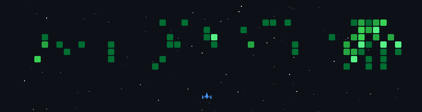

<div align="center">


[](https://git.io/typing-svg)

<a href="https://www.linkedin.com/in/pablo-alejandro-marroquin"></a>
<a href="mailto:pabloalejandrocutz@gmail.com"></a>
<a href="https://www.instagram.com/pablomq_13/"></a>


</div>

## 🧑‍💻 Sobre mí

<table>
<tr>
<td width="62%">

```python
class PabloMarroquin:
    def __init__(self):
        self.rol        = "Backend Developer en formación"
        self.educacion  = "Ing. en Ciencias y Sistemas — 10mo semestre, USAC 🇬🇹"
        self.stack      = ["Python", "Java", "FastAPI", "Docker", "PostgreSQL"]
        self.aprendiendo = ["Bases de datos distribuidas", "GCP", "IA aplicada"]
        self.metodologias = ["Scrum", "GitFlow"]

    def dato_curioso(self):
        return "He modelado datos en grafos (Neo4j), clusters (Cassandra) y hasta en Prolog 🤯"
```

- 🌱 Actualmente profundizando en **bases de datos distribuidas, cloud (GCP) y arquitectura backend**
- 🤖 Me apasiona llevar la **IA a aplicaciones reales**, no solo a notebooks
- 💬 Preguntame sobre **Java, Python o Apache Cassandra**

</td>
<td width="38%" align="center">

<!-- Avatar pixel-art que se dibuja solo (generado por el workflow Pixel Avatar) -->


<sub>🎨 <i>Mi avatar renderizado en pixel-art — se dibuja solo</i></sub>

</td>
</tr>
</table>

## 🏅 Logros

<div align="center">


</div>

##  Proyectos destacados

<table>
<tr>
<td width="50%">

### 🧾 [SmartInvoice — OCR de Facturas](https://github.com/PabloMarroquinnn1/smart-invoice-ocr)
Plataforma de procesamiento automático de facturas con **Computer Vision (OpenCV)**, **OCR (Tesseract)** y **RPA (Selenium)**. Extrae datos de PDF/imágenes, genera reportes y automatiza registros.

`Python` `FastAPI` `OpenCV` `Tesseract` `Docker`

</td>
<td width="50%">

### 🤖 [SmartBot — Telegram FAQ Bot](https://github.com/PabloMarroquinnn1/telegram-faq-bot)
Bot de respuestas automatizadas con **panel administrativo web**, API REST, autenticación **JWT** y logging de interacciones.

`Python` `FastAPI` `PostgreSQL` `JWT` `Docker`

</td>
</tr>
<tr>
<td width="50%">

### 🎬 [RecomendaDB — Movie Recommender](https://github.com/PabloMarroquinnn1/neo4j-movie-recommender)
Motor de recomendación de películas sobre **grafos**: sugerencias sociales, grados de separación con `shortestPath` (BFS) y análisis de patrones con Cypher.

`Neo4j` `Cypher` `APOC` `Python` `Docker`

</td>
<td width="50%">

### 🏨 [Sistema de Reservas Distribuido](https://github.com/PabloMarroquinnn1/-cassandra-booking-system)
Sistema de reservas sobre un **clúster de 3 nodos Apache Cassandra**: modelado query-driven, pruebas de tolerancia a fallos y análisis de niveles de consistencia.

`Cassandra` `CQL` `Docker Compose`

</td>
</tr>
<tr>
<td width="50%">

### 🗺️ [Prolog Route Finder](https://github.com/PabloMarroquinnn1/prolog-route-finder)
Buscador de rutas entre ciudades de Guatemala usando **SWI-Prolog como motor de inferencia**, con backend FastAPI y UI web interactiva.

`Prolog` `FastAPI` `HTML/JS`

</td>
<td width="50%">

### 🩺 [Sistema Experto de Diagnóstico](https://github.com/PabloMarroquinnn1/Prolog-diagnostic-expert-system)
Sistema experto para diagnóstico de computadoras con **SWI-Prolog**, API en Flask, interfaz web y notificaciones vía bot de Telegram.

`Prolog` `Flask` `Telegram API`

</td>
</tr>
</table>

## 🛠️ Stack Tecnológico

<div align="center">

**Lenguajes**


**Frameworks y Librerías**


**Bases de Datos**


**Herramientas y Cloud**


</div>

## 🕹️ Zona Arcade

<div align="center">

### 🚀 Mis contribuciones convertidas en batalla espacial

<!-- Generado por GitHub Actions (workflow Space Shooter) — mis commits son los enemigos -->


<br/><br/>

### 🐍 Y la serpiente que se las come

<picture>
  <source media="(prefers-color-scheme: dark)" srcset="https://raw.githubusercontent.com/PabloMarroquinnn1/PabloMarroquinnn1/output/github-snake-dark.svg" />
  <source media="(prefers-color-scheme: light)" srcset="https://raw.githubusercontent.com/PabloMarroquinnn1/PabloMarroquinnn1/output/github-snake.svg" />
  
</picture>

<sub><i>Mis commits no descansan: de día son invadidos por una nave, de noche se los come una serpiente</i> 😅</sub>

</div>

##  Estadísticas

<div align="center">


<br/><br/>

<!-- Generado por GitHub Actions (workflow Metrics) — incluye stats, lenguajes, calendario y logros -->


</div>

---

<div align="center">

### ⭐ *"El código que escribís hoy es el legado que dejás mañana"* ⭐


</div>
